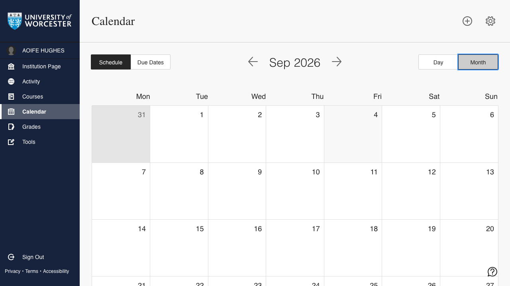
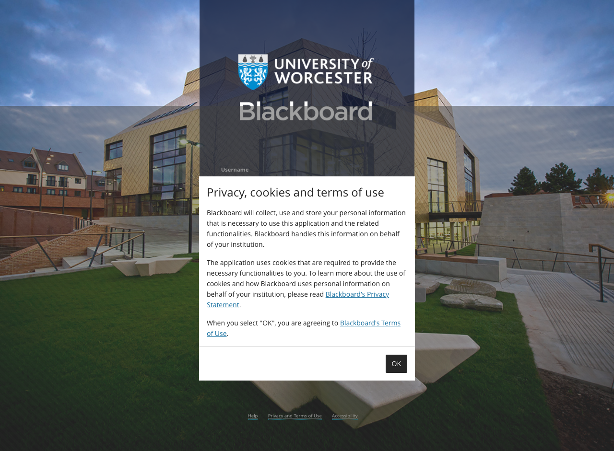
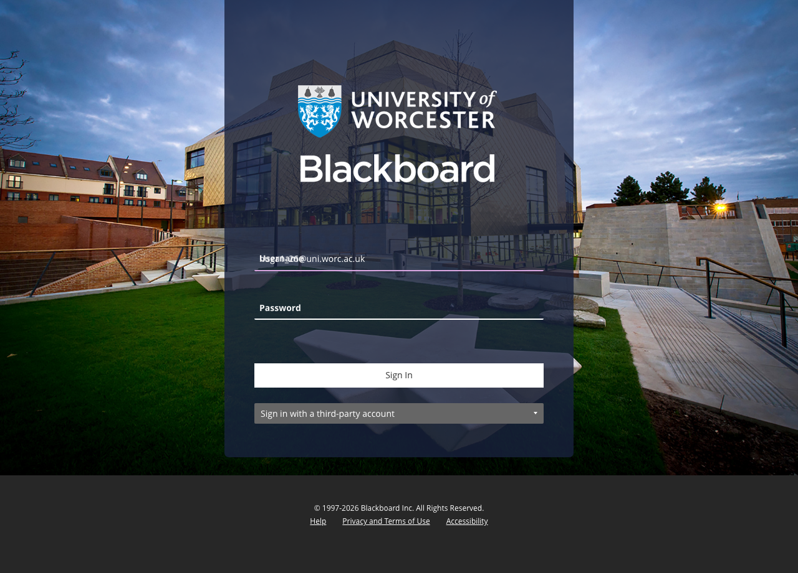
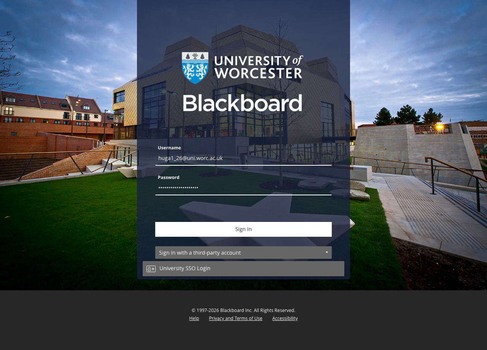
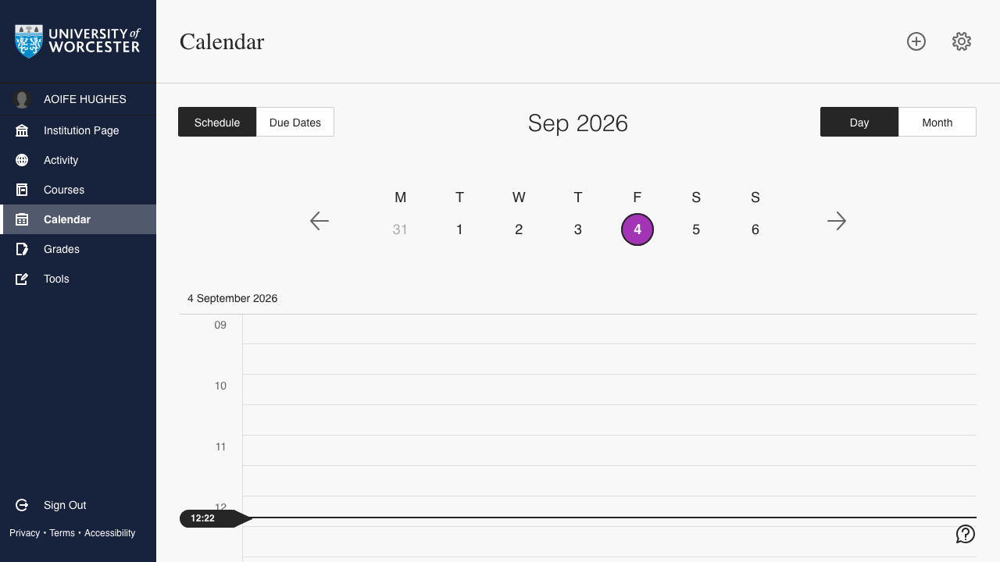
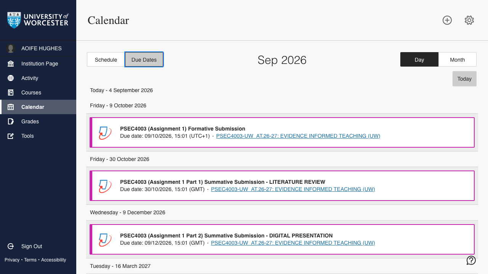

# Lesson 02 — Real project: Worcester timetable + Blackboard due dates

## Objective

A real Playwright automation, end to end. This folder pulls your Worcester
timetable events and your Blackboard assignment due dates into two plain
JSON files (`events.json` and `due_dates.json`) under your control, with no
third-party calendar integration in the loop.

Both fetchers are **prompt-driven**: each one opens a headed Chromium, lands
on the sign-in form, prints a terminal prompt asking you to sign in in the
browser window that just opened, and waits for the URL to come back. You
type your credentials yourself; the script just blocks until you're past
the login host. Nothing sensitive lives in the repo.

## Files in this lesson

| File | Purpose |
|------|---------|
| `fetch_events.py` | Opens `mytimetable.worc.ac.uk` in a headed browser, waits for the Microsoft/ADFS login, captures the `FilterIncludePersonalAndBookings` XHR, writes `events.json`. |
| `fetch_due_dates.py` | Opens Worcester Blackboard, walks the third-party SSO accordion, waits for the login, paginates `/learn/api/v1/calendars/dueDateCalendarItems`, writes `due_dates.json`. |
| `login_flow.py` | Shared `wait_for_user_login(page)` helper used by both fetchers - prints the prompt, polls the URL until it leaves the Microsoft/ADFS hosts. |
| `PROJECT.md` | The operational guide - what each script does in detail, hardcoded values, how to update for a new academic year. |
| `screenshots/` | The walkthrough images embedded in this README. |

## Before you start

Activate the shared virtualenv once per terminal session:

```bash
source ../.venv/bin/activate
```

If you haven't synced deps in this checkout yet:

```bash
uv sync                                  # at the repo root
uv run playwright install chromium       # one-time browser download
```

## Steps

### Step 1 — Install dependencies

If `uv sync` and `uv run playwright install chromium` haven't been run in
this checkout yet, do those now (commands above). After that, both scripts
run from the repo root with plain `uv run python`.

### Step 2 — Fetch the Worcester timetable

```bash
uv run python 02_Real_Project_Calendar/fetch_events.py
```

A headed Chromium opens, lands on the Worcester sign-in (Microsoft/ADFS for
mytimetable), and the script prints the prompt. You sign in (username,
password, 2FA if it asks) in the browser; the script blocks on
`wait_for_user_login` until the URL comes back, then navigates to the
timetable view and captures the `FilterIncludePersonalAndBookings` XHR. The
events are flattened into a list and written to `events.json` (use `-o` to
redirect).


*The Worcester calendar UI once you're signed in - the mytimetable page this script targets is a separate app but the idea is the same.*

### Step 3 — Fetch Blackboard due dates

```bash
uv run python 02_Real_Project_Calendar/fetch_due_dates.py
```

The login shape is different here. Blackboard shows its own form first, then
the "Sign in with a third-party account" accordion that opens onto the
University SSO. The script's inlined `start_sso` walks that accordion and
hands off to `wait_for_user_login`; you do the actual sign-in yourself.

This is roughly what the browser shows while the script waits:


*The cookie consent modal that pops up first - the script clicks "OK" before doing anything else.*


*The Worcester Blackboard sign-in form - the script opens the third-party SSO accordion for you.*


*Username typed in, password next.*


*Password typed in - the "Sign in with a third-party account" accordion is expanded to reveal "University SSO Login".*


*You're on the Worcester Blackboard Calendar (Schedule tab); the script now paginates the due-dates API behind the scenes.*


*The Due Dates tab - what `fetch_due_dates.py` reads from under the hood, pulled from the API rather than scraped off the DOM.*

Output goes to `due_dates.json` (override with `-o`).

### Step 4 — What's in the JSON

`events.json` is one row per session: `uid`, `name`, `description`, `type`,
`start`, `end`, `location`, `status`, `week_label`. Order is whatever the
timetable hands back.

`due_dates.json` is one row per assignment: `uid`, `title`, `due`, `course`,
`course_url`, `type`. Sorted ascending by `due`. `course_url` points at the
Blackboard outline page - Turnitin LTI launches are one-time, so we use the
stable outline URL instead.

## The full operational guide

The "running manual" - what each script does in detail, hardcoded values,
how to update for a new academic year, what's tracked vs gitignored - lives
in [`PROJECT.md`](PROJECT.md). Read it once you've got the shape from the
steps above.

## Why this lesson matters

It's the lesson 01 idea stretched onto something real, and it shows the bits
a toy scrape doesn't have to worry about:

- **Authentication** you can't `page.goto()` past - a multi-step Microsoft
  sign-in, TOTP, possible interstitials, all handled by waiting on the URL
  and letting you type the credentials yourself.
- **Reading data the site never renders plainly** - the timetable arrives
  as an XHR response the Angular UI consumes, and `fetch_events.py` just
  hooks `page.on("response", ...)` to grab it.
- **Prompt-driven login** - no credentials, no env vars, no vault, no
  system password store. You type your password in the browser; the script
  waits. Nothing sensitive ends up in the repo.
- **Two slightly different login shapes** - mytimetable goes straight to
  Microsoft/ADFS, Blackboard makes you open a third-party SSO accordion
  first. Same helper, two small front-ends.
